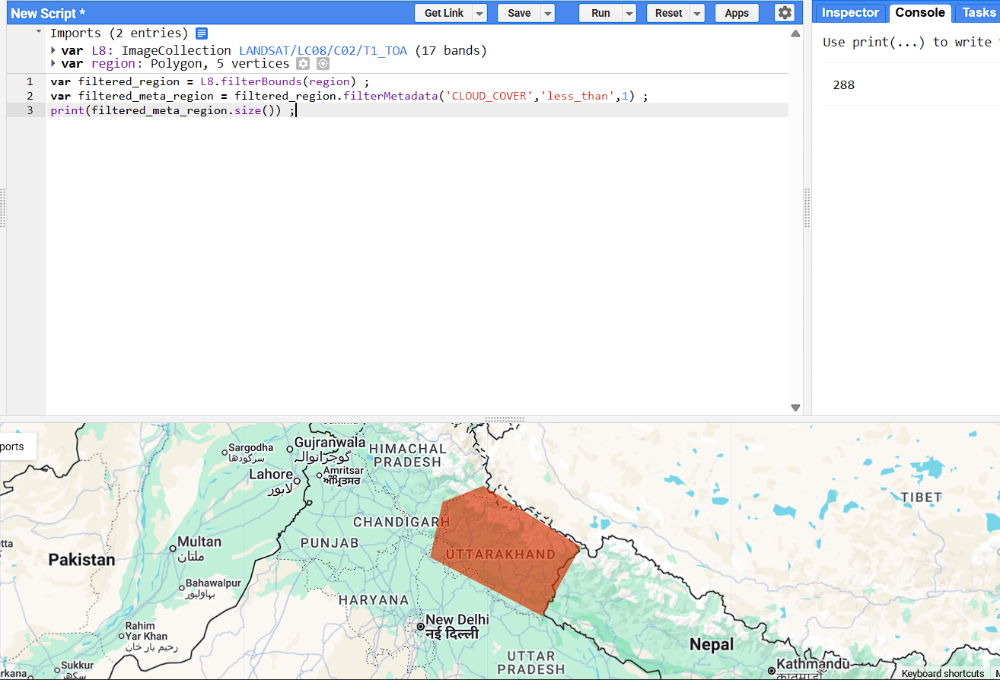
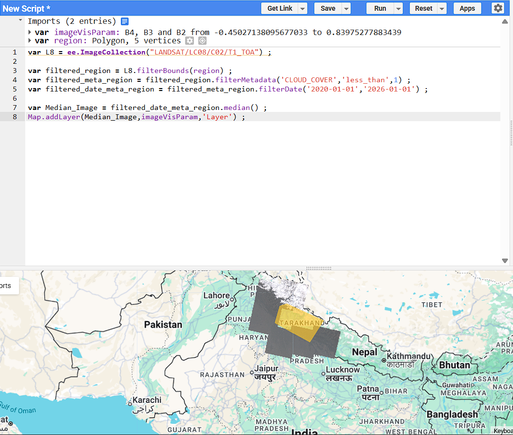

# Google Earth Engine 

## Difference between Client and Server

### Client Objects 
Regular javascript objects or functions provided by default are executed on the client device

```js
var a = 10 ;
var b = 20 ;
var c = a + b ;
print(c)  ;   // c is a number here
```

### Server Objects
Server Functions and Variable executed by google engine server are generally 
Initialized using ee (double e)

```js
var a = ee.Number(30) ;
var b = ee.Number(20) ; 
var c = a.add(b) ;
print(c) ;  // c is an object here
```

```js
var a = ee.Number(30) ;
var b = ee.Number(20) ; 
var c = a.eq(b) ;

if(c){
  print("true") ;
}
else{
  print("false") ;
}

print(c)  ; // true since c is coming as an object 
```


## Filtering and Displaying Data

### To Import Data Set 
-> use `ee.ImageCollection("dataset_id")`

**Example**
```js
var L8 = ee.ImageCollection("LANDSAT/LC08/C02/T1_TOA") ;
```
-> To know about the functions that work on imported images data (i.e ImageCollection) open the docs on see `ee.imageCollection`

### Filtering Data
ee.Geometry.Polygon() -> To select a region of interest (ROI) or you can create a shape in map of google map  
.filterBounds(geometry) -> To Filter the data based on the ROI / Geometric Shape  
.filterMetadata(field_name,operator,value) -> To Filter the data based on the metadata/specific field  
.filterDate(start_date,end_date) -> To Filter the data based on the date  
.size() -> To get the size of the data   

**Example** 

  

```js
var L8 = ee.ImageCollection("LANDSAT/LC08/C02/T1_TOA") ;
var region = ee.Geometry.Polygon({
  coords : [[
    [80.02087820654869,28.823609831641118],
    [80.89978445654869,30.21931118367884],
    [78.65857351904869,31.426894827845015],
    [77.71374930029869,31.1076142775064],
    [77.42810476904869,30.0102362174155],
    [80.02087820654869,28.823609831641118]
  ]]
}) ;

var filtered_region = L8.filterBounds(region) ;
var filtered_meta_region = filtered_region.filterMetadata('CLOUD_COVER','less_than',1) ;
var filtered_date_meta_region = filtered_meta_region.filterDate('2020-01-01','2026-01-01') ;
```


### Displaying Data
* Map.addLayer(image,imageCoords,layerName) -> to add image on map // imageCoords and layerName is optional



## Calculating with Images 
-> check the `ee.Image` in docs for it's corresponding methods 

* ee.Image() -> To create an image
* imageA.add(imageB) -> to add the images  


**NDVI(Normalized Difference Vegetation Index)** 
------------------------------------------------
* Calcuting NVDI (Normalized Difference Vegetation Index) represent amount of `green` in certain place 
* Normalized Difference of 2 Bands = (Subtracting of the 2 bands) / (Sum of the 2 Bands)

  NDVI is close to 1 -> when there is more vegetation  
  NDVI is close to 0 -> when there is less vegetation  
  NDVI is close to -1 -> when water is present


### Calculation on a single image 

**NDVI over multiple images**
```js 
var L8 = ee.ImageCollection("LANDSAT/LC08/C02/T1_TOA") ; 
var image = L8.filterBounds(ee.Geometry.Point(-4,56.9)).filterMetadata('CLOUD_COVER','less_than',1).first() ;

// Selecting the bands 
var RED = image.select('B4') ;  // RED
var NIR = image.select('B5') ;  // Near infrared


// NDVI Calculation

// Method 1
var NDVI = NIR.subtract(RED).divide(NIR.add(RED));

// Method 2 
var NDVI = image.expression(
  '(NIR-RED)/(NIR+RED)',
  { 
    // variable names used in expression with thier corresponding data 
    'NIR' : NIR ,
    'RED' : RED
  }    
)

// Method 3 -> Passing Band Index
var NDVI = image.expression('(b(4) - b(3))/(b(4) + b(3))')

// Method 4 -> Passing Band Name
var NDVI = image.expression('(b("B5") - b("B4")) / (b("B5") + b("B4"))')
Map.addLayer(NDVI) ;
```


### Calculation over multiple image 

**NDVI over multiple images**
```js
var L8 = ee.ImageCollection("LANDSAT/LC08/C02/T1_TOA") ; 
var collection = L8.filterBounds(geometry)
                    .filterMetadata('CLOUD_COVER','less_than',1) ;

// create a JS function and map that function over the collection
function CalculateNVDI(image){
  var selected = image.select('B4','B5') ; // selected Image contains 2 Bands only 
  var NDVI = selected.expression('(b(1)-b(0))/(b(1)+b(0))').select(['B5'],['NDVI']) ; // calling B5 as NDVI
  return NDVI ; 
}

var NDVIcollection = collection.map(CalculateNVDI)
print(NDVIcollection) ;
```

### Iterative calculation over images

**Asses the serverness of drought**   
* by calculating the maximum amount of consecutive dry days in a region a year  
* using the precipitaion data from `PERSIANN` dataset   
* Adding 1 to when it has not rained and 0 when it has rained

```js
var PERSIANN = ee.ImageCollection("NOAA/PERSIANN-CDR") ;
var DataCollection = PERSIANN.filterDate('2024-01-01','2025-01-01') ;
var Init = ee.Image.constant(0)   // Image having only 0 at each cell 
.rename('precipitation')  // renaming the band with name precipitaion
.cast({'precipitation' : 'long'}) ;

function CalDryDays(current,previous){
  var Mask = current.remap([0],[1],0) ; // map all 0s to 1s and others as 0s
  var LastImage = ee.Image(ee.List(previous).get(-1)) ;
  var Updated = LastImage.add(Mask).multiply(Mask) ;
  
  return ee.List(previous).add(Updated) ;
}

var result = ee.List(DataCollection.iterate(CalDryDays,ee.List([Init]))) ;
var ResultCollection = ee.ImageCollection(result) ;

var ResultImage = ResultCollection.max() ;
Map.addLayer(ResultImage,imageVisParam) ;
/*
.iterate(algorithm,first)  -> returns an computed object
algorithm -> The function to apply to each element. Must take two arguments: an element of the collection and the value from the previous iteration.
first -> The initial state.
*/

```

## Importing raster / vector data 
* import data from EarthData(NASA) or EarthExplorer(USGS)

### Raster Data 
* has to be uploaded in .geotiff format for google earth engine , is a type of .tiff image with georefrencing information .
* or you can upload .tiff file with .tfw file (contains refrencing data) .

**To upload the raster data** : go to assets -> select image upload 

### Vector Data 
* has to be uploaded with .shp + .dfx + .shx files together for google earth engine .
* or you can upload .tiff file with .tfw file (contains refrencing data) .

**To upload the table data** : go to assets -> select table upload 


# Exporting Data 
* search export in the docs

```js

var L8 = ee.ImageCollection("LANDSAT/LC08/C02/T1_TOA") ;

var image = L8.filterBounds(point)
.filterMetadata("CLOUD_COVER","less_than",1)
.median() ;              

Map.addLayer(image) ;

// Exporting to Raster Format
/*
Export.image.toAsset({
  image : image,
  description : "uttrakhandImage1",
  assetId : "uk_1",
  pyramidingPolicy : {".default" : "min"},
  region : point,
  scale : 30 ,
  crs : "EPSG:21096", // coordinate refrence system
  maxPixels : 1e13 // max amount of pixels in the image
})


Export.image.toDrive({ 
  image : image.float(),
  description : "uttrakhandImage1",
  folder : "GEE_DATA",
  fileNamePrefix : "uk" ,
  region : point,
  scale : 30 ,
  crs : "EPSG:21096", // coordinate refrence system
  maxPixels : 1e13, // max amount of pixels in the image,
  shardSize : 100,  // should be a multiple of maxPixels and divides the images of 100 pixels each
  fileDimensions : 5000,
  fileFormat : "GeoTIFF" // file format supported is GeoTiff or TFRecord (used as input in TensorFlow (a ML Tool)
}) ;
*/


// Export Vector Data
/*
var ExampleTable = ee.FeatureCollection([
  ee.Feature(null, {name : "Lake" , color : "Blue" , Size : 100}) ,
  ee.Feature(null, {name : "Forest" , color : "Green" , Size : 200}),
  ee.Feature(null, {name : "Buildings" , color : "Grey" , Size : 50})  
])

Export.table.toDrive({
  collection : ExampleTable ,
  description : "ExampleTable" ,
  folder : "GEE_DATA",
  fileNamePrefix : "Table" ,
  fileFormat : "CSV" ,
  selectors : ["name","color"]  // which features to select
}) ;

var collection = L8.filterBounds(point)
.filterMetadata("CLOUD_COVER","less_than",10)
.select(["B4","B3","B2"]) // the collection should have 3 Bands only (red,blue,green)            
.filter(function(image){return image.multiply(512).uint8() ;} ) ;
*/

// Exporting as an video 
Export.video.toDrive({
  collection : collection ,
  description : "VideoExport" ,
  folder : "GEE_DATA",
  framePerSecond : 1 ,
  region : point,
  maxFrames : 50, // max no of frame the video can have 
})

```